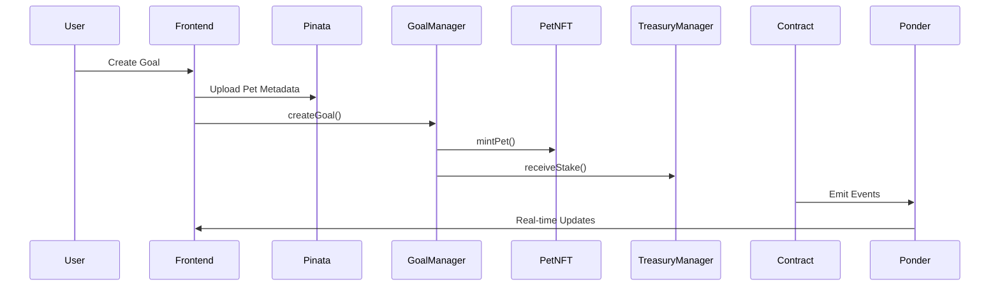
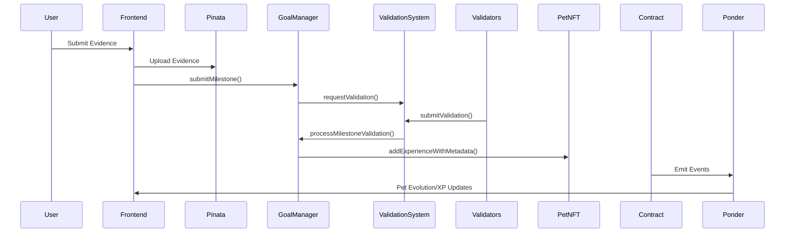

# Pet Pat Technical Documentation

## Frontend Engineer Integration Guide

### Table of Contents
1. [System Overview](#system-overview)
2. [Core User Flows](#core-user-flows)
3. [Smart Contract Integration](#smart-contract-integration)
4. [Pinata Metadata Management](#pinata-metadata-management)
5. [Ponder GraphQL Queries](#ponder-graphql-queries)
6. [Event Listeners](#event-listeners)
7. [Error Handling](#error-handling)
8. [Testing Guide](#testing-guide)

---

## System Overview

Pet Pat is a goal achievement platform where users stake PAT tokens, set goals with milestones, and grow virtual pets through validated progress.

### Architecture
```
Frontend ↔ Smart Contracts ↔ Ponder Indexer ↔ GraphQL API
                ↕
           Pinata IPFS (Metadata)
```

### Core Components
- **5 Smart Contracts**: PAT Token, Treasury, Validation, Pet NFT, Goal Manager
- **Ponder Indexer**: Real-time event indexing and GraphQL API
- **Pinata IPFS**: Decentralized metadata storage for pet images/data

---

## Core User Flows

### 1. Goal Creation Flow


### 2. Milestone Submission Flow


### 3. Pet Evolution Flow


---

## Smart Contract Integration

### Required Contract Instances
```javascript
// Contract addresses (from deployment)
const CONTRACTS = {
  PAT_TOKEN: "0x...",
  TREASURY_MANAGER: "0x...", 
  VALIDATION_SYSTEM: "0x...",
  PET_NFT: "0x...",
  GOAL_MANAGER: "0x..."
};

// ABI imports
import { PATTokenABI, GoalManagerABI, PetNFTABI } from './abis';
```

### Primary Write Functions by User Action

#### 1. Create Goal
```javascript
// Contract: GoalManager
await goalManager.createGoal(
  title,                    // string
  stakeAmount,             // uint256 (in wei)
  durationDays,            // uint256
  petName,                 // string
  petType,                 // 0=DRAGON, 1=CAT, 2=PLANT
  petMetadataIPFS,         // string (from Pinata)
  totalMilestones          // uint256
);
```

#### 2. Create Milestone
```javascript
// Contract: GoalManager
await goalManager.createMilestone(
  goalId,                  // uint256
  description              // string
);
```

#### 3. Submit Milestone Evidence
```javascript
// Contract: GoalManager
await goalManager.submitMilestone(
  milestoneId,            // uint256
  evidenceIPFS            // string (from Pinata)
);
```

#### 4. Approve PAT Token Spending
```javascript
// Contract: PATToken (before creating goals)
await patToken.approve(
  CONTRACTS.TREASURY_MANAGER,  // spender
  stakeAmount                  // amount
);
```

### Read-Only Functions (Use Sparingly)
```javascript
// Check if goal exists and is active
const isActive = await goalManager.isGoalActive(goalId);

// Check if goal is expired
const isExpired = await goalManager.isGoalExpired(goalId);

// Get pet existence
const exists = await petNFT.exists(tokenId);

// Get total supply
const totalSupply = await petNFT.totalSupply();
```

---

## Pinata Metadata Management

### Required Pinata Setup
```javascript
const PINATA_CONFIG = {
  apiKey: process.env.REACT_APP_PINATA_API_KEY,
  secretKey: process.env.REACT_APP_PINATA_SECRET_KEY,
  gateway: "https://gateway.pinata.cloud/ipfs/"
};
```

### Pet Metadata Template
```javascript
const generatePetMetadata = (petData) => ({
  name: petData.name,
  description: "A Pat Pet companion that grows with your goal achievements",
  image: `ipfs://${getImageHash(petData.petType, petData.stage, petData.isHappy)}`,
  external_url: `https://patpet.xyz/pet/${petData.tokenId}`,
  attributes: [
    { trait_type: "Pet Type", value: petData.petType },
    { trait_type: "Evolution Stage", value: petData.stage },
    { trait_type: "Level", value: petData.level },
    { trait_type: "Experience", value: petData.experience },
    { trait_type: "Mood", value: petData.isHappy ? "Happy" : "Sad" },
    { trait_type: "Milestones Completed", value: petData.totalMilestonesCompleted },
    { trait_type: "Goal ID", value: petData.goalId },
    { trait_type: "Birth Date", value: petData.birthTime },
    { trait_type: "Rarity", value: getRarityFromStage(petData.stage) }
  ],
  properties: {
    last_updated: Date.now(),
    version: petData.version || 1
  }
});
```

### Image Hash Mapping
```javascript
const IMAGE_HASHES = {
  DRAGON: {
    EGG: { happy: "QmDragonEggHappyPNG", sad: "QmDragonEggSadPNG" },
    BABY: { happy: "QmDragonBabyHappyPNG", sad: "QmDragonBabySadPNG" },
    ADULT: { happy: "QmDragonAdultHappyPNG", sad: "QmDragonAdultSadPNG" }
  },
  CAT: {
    EGG: { happy: "QmCatEggHappyPNG", sad: "QmCatEggSadPNG" },
    BABY: { happy: "QmCatBabyHappyPNG", sad: "QmCatBabySadPNG" },
    ADULT: { happy: "QmCatAdultHappyPNG", sad: "QmCatAdultSadPNG" }
  },
  PLANT: {
    EGG: { happy: "QmPlantSeedHappyPNG", sad: "QmPlantSeedSadPNG" },
    BABY: { happy: "QmPlantSproutHappyPNG", sad: "QmPlantSproutSadPNG" },
    ADULT: { happy: "QmPlantAdultHappyPNG", sad: "QmPlantAdultSadPNG" }
  }
};
```

### Upload Functions
```javascript
// Upload pet metadata to Pinata
const uploadMetadata = async (metadata, tokenId) => {
  const response = await fetch('https://api.pinata.cloud/pinning/pinJSONToIPFS', {
    method: 'POST',
    headers: {
      'Content-Type': 'application/json',
      'pinata_api_key': PINATA_CONFIG.apiKey,
      'pinata_secret_api_key': PINATA_CONFIG.secretKey
    },
    body: JSON.stringify({
      pinataContent: metadata,
      pinataMetadata: {
        name: `pet-${tokenId}-metadata-${Date.now()}`,
        keyvalues: {
          type: 'pet_metadata',
          tokenId: tokenId?.toString() || 'new',
          timestamp: Date.now().toString()
        }
      }
    })
  });
  
  const result = await response.json();
  return result.IpfsHash;
};

// Upload evidence file
const uploadEvidence = async (file) => {
  const formData = new FormData();
  formData.append('file', file);
  
  const response = await fetch('https://api.pinata.cloud/pinning/pinFileToIPFS', {
    method: 'POST',
    headers: {
      'pinata_api_key': PINATA_CONFIG.apiKey,
      'pinata_secret_api_key': PINATA_CONFIG.secretKey
    },
    body: formData
  });
  
  const result = await response.json();
  return result.IpfsHash;
};
```

---

## Ponder GraphQL Queries

### User Dashboard Queries

#### Get User Goals
```graphql
query GetUserGoals($userAddress: String!) {
  goalCreateds(where: { owner: $userAddress }) {
    id
    goalId
    title
    stakeAmount
    endTime
    totalMilestones
    petTokenId
    petType
    petName
    timestamp
    status
    milestonesCompleted
  }
}
```

#### Get Goal Details with Milestones
```graphql
query GetGoalDetails($goalId: String!) {
  goalCreateds(where: { goalId: $goalId }) {
    id
    goalId
    owner
    title
    stakeAmount
    endTime
    totalMilestones
    petTokenId
    petType
    petName
    timestamp
  }
  
  milestoneCreateds(where: { goalId: $goalId }) {
    id
    milestoneId
    description
    milestoneIndex
    timestamp
  }
  
  milestoneCompleteds(where: { goalId: $goalId }) {
    id
    milestoneId
    xpAwarded
    progressPercentage
    timestamp
  }
}
```

#### Get Pet Details and Evolution History
```graphql
query GetPetDetails($tokenId: String!) {
  petMinteds(where: { tokenId: $tokenId }) {
    id
    tokenId
    owner
    name
    petType
    goalId
    metadataIPFS
    timestamp
  }
  
  experienceGaineds(where: { tokenId: $tokenId }) {
    id
    experienceAmount
    newTotalExperience
    newLevel
    reason
    timestamp
  }
  
  petEvolveds(where: { tokenId: $tokenId }) {
    id
    fromStage
    toStage
    currentExperience
    evolutionTime
    timestamp
  }
  
  petMoodChangeds(where: { tokenId: $tokenId }) {
    id
    oldMood
    newMood
    reason
    timestamp
  }
}
```

### Analytics Queries

#### Platform Statistics
```graphql
query GetPlatformStats {
  goalSystemStatistics(orderBy: timestamp, orderDirection: desc, first: 1) {
    totalGoalsCreated
    activeGoals
    completedGoals
    failedGoals
    successRate
    totalStakeAmount
    totalMilestonesCompleted
    timestamp
  }
  
  petStatisticsSnapshots(orderBy: timestamp, orderDirection: desc, first: 1) {
    totalSupply
    totalEggStage
    totalBabyStage
    totalAdultStage
    totalHappyPets
    totalSadPets
    averageExperience
    timestamp
  }
}
```

#### Validation Statistics
```graphql
query GetValidationStats {
  validationStatistics(orderBy: timestamp, orderDirection: desc, first: 1) {
    totalRequests
    totalCompleted
    totalActiveValidators
    totalRewardsDistributed
    systemAccuracyRate
    timestamp
  }
  
  validatorRegistereds {
    validator
    stakedAmount
    totalActiveValidators
    timestamp
  }
}
```

#### Treasury Analytics
```graphql
query GetTreasuryStats {
  treasuryStatistics(orderBy: timestamp, orderDirection: desc, first: 1) {
    totalStakesReceived
    totalRewardsDistributed
    totalTokensBurned
    totalGoalsCompleted
    totalGoalsFailed
    successRate
    timestamp
  }
  
  poolBalancesSnapshots(orderBy: timestamp, orderDirection: desc, first: 1) {
    rewardPool
    insurancePool
    validatorPool
    developmentPool
    totalBalance
    timestamp
  }
}
```

### Real-time Event Subscriptions
```graphql
subscription GoalEvents($userAddress: String!) {
  goalCreateds(where: { owner: $userAddress }) {
    goalId
    title
    petTokenId
    timestamp
  }
  
  milestoneCompleteds(where: { goalOwner: $userAddress }) {
    goalId
    milestoneId
    xpAwarded
    progressPercentage
    timestamp
  }
  
  petEvolveds(where: { owner: $userAddress }) {
    tokenId
    fromStage
    toStage
    timestamp
  }
}
```

---

## Event Listeners

### Required Event Listeners for Real-time Updates

#### Goal Events
```javascript
// Listen for goal completion
goalManager.on('GoalCompleted', (goalId, owner, milestonesCompleted, bonusXP, stakeReward, completionTime, wasEarly, petMetadata, timestamp) => {
  // Update UI with completion celebration
  // Show rewards earned
  // Display final pet evolution
});

// Listen for goal failure
goalManager.on('GoalFailed', (goalId, owner, milestonesCompleted, totalMilestones, stakeLost, reason, sadPetMetadata, timestamp) => {
  // Update UI with failure state
  // Show pet sad animation
  // Display stake lost information
});
```

#### Milestone Events
```javascript
// Listen for milestone completion
goalManager.on('MilestoneCompleted', (milestoneId, goalId, owner, xpAwarded, newMilestonesCompleted, totalMilestones, progressPercentage, petMetadata, timestamp) => {
  // Update progress bar
  // Show XP gained animation
  // Check for pet evolution
});

// Listen for milestone rejection
goalManager.on('MilestoneRejected', (milestoneId, goalId, owner, reason, sadPetMetadata, timestamp) => {
  // Show rejection notification
  // Display feedback to user
  // Update pet to sad state
});
```

#### Pet Events
```javascript
// Listen for pet evolution
petNFT.on('PetEvolved', (tokenId, goalId, owner, fromStage, toStage, currentExperience, evolutionTime, newMetadata, timestamp) => {
  // Show evolution animation
  // Update pet display
  // Celebrate milestone achievement
});

// Listen for mood changes
petNFT.on('PetMoodChanged', (tokenId, goalId, owner, oldMood, newMood, reason, newMetadata, timestamp) => {
  // Update pet expression
  // Show appropriate animations
  // Display mood change reason
});
```

#### Validation Events
```javascript
// Listen for validation resolution
validationSystem.on('ValidationResolved', (milestoneId, status, approvals, rejections, validators, votes, resolutionTime, timestamp) => {
  // Update milestone status
  // Show validation results
  // Trigger appropriate pet updates
});
```

---

## Error Handling

### Common Error Scenarios

#### Transaction Errors
```javascript
try {
  const tx = await goalManager.createGoal(...params);
  await tx.wait();
} catch (error) {
  if (error.code === 'INSUFFICIENT_FUNDS') {
    showError('Insufficient ETH for gas fees');
  } else if (error.message.includes('Transfer failed')) {
    showError('Insufficient PAT tokens or approval needed');
  } else if (error.code === 'USER_REJECTED') {
    showError('Transaction cancelled by user');
  } else {
    showError('Transaction failed: ' + error.message);
  }
}
```

#### Contract Interaction Errors
```javascript
// Check contract state before transactions
const checkGoalState = async (goalId) => {
  const isActive = await goalManager.isGoalActive(goalId);
  const isExpired = await goalManager.isGoalExpired(goalId);
  
  if (!isActive) {
    throw new Error('Goal is not active');
  }
  if (isExpired) {
    throw new Error('Goal has expired');
  }
};
```

#### Pinata Upload Errors
```javascript
const handlePinataError = (error) => {
  if (error.status === 401) {
    return 'Invalid Pinata API credentials';
  } else if (error.status === 413) {
    return 'File too large for upload';
  } else if (error.status === 429) {
    return 'Rate limit exceeded, please try again later';
  } else {
    return 'Upload failed, please try again';
  }
};
```

---

## Testing Guide

### Unit Testing Contract Interactions
```javascript
describe('Goal Creation', () => {
  it('should create goal and mint pet', async () => {
    // Mock contract calls
    const mockGoalManager = {
      createGoal: jest.fn().mockResolvedValue({ hash: '0x123' })
    };
    
    // Test goal creation flow
    const result = await createGoal({
      title: 'Test Goal',
      stakeAmount: '100',
      durationDays: 30,
      petName: 'Fluffy',
      petType: 1,
      totalMilestones: 10
    });
    
    expect(mockGoalManager.createGoal).toHaveBeenCalledWith(
      'Test Goal',
      ethers.utils.parseEther('100'),
      30,
      'Fluffy',
      1,
      expect.any(String), // metadata IPFS hash
      10
    );
  });
});
```

### Integration Testing with Local Blockchain
```javascript
describe('Goal Flow Integration', () => {
  let goalManager, petNFT, patToken;
  
  beforeEach(async () => {
    // Deploy contracts to local blockchain
    // Setup test accounts
    // Mint test PAT tokens
  });
  
  it('should complete full goal lifecycle', async () => {
    // 1. Create goal
    // 2. Create milestones  
    // 3. Submit evidence
    // 4. Validate milestones
    // 5. Check pet evolution
    // 6. Complete goal
    // 7. Verify rewards
  });
});
```

### GraphQL Query Testing
```javascript
describe('Ponder GraphQL Queries', () => {
  it('should fetch user goals correctly', async () => {
    const query = `
      query GetUserGoals($userAddress: String!) {
        goalCreateds(where: { owner: $userAddress }) {
          goalId
          title
          stakeAmount
        }
      }
    `;
    
    const result = await apolloClient.query({
      query: gql(query),
      variables: { userAddress: '0x123...' }
    });
    
    expect(result.data.goalCreateds).toHaveLength(1);
    expect(result.data.goalCreateds[0].title).toBe('Test Goal');
  });
});
```

---

## Quick Reference

### Contract Write Functions by Feature

| Feature | Contract | Function | Parameters |
|---------|----------|----------|------------|
| Create Goal | GoalManager | `createGoal()` | title, stakeAmount, durationDays, petName, petType, petMetadataIPFS, totalMilestones |
| Create Milestone | GoalManager | `createMilestone()` | goalId, description |
| Submit Evidence | GoalManager | `submitMilestone()` | milestoneId, evidenceIPFS |
| Approve Tokens | PATToken | `approve()` | spender, amount |

### Evolution Thresholds
- **EGG → BABY**: 100 XP (4 milestones)
- **BABY → ADULT**: 500 XP (20 milestones)
- **Milestone XP**: 25 XP per milestone
- **Completion Bonus**: 100 XP per goal

### Pet Types
- **0**: DRAGON
- **1**: CAT  
- **2**: PLANT

### Goal Status
- **0**: ACTIVE
- **1**: COMPLETED
- **2**: FAILED

---

## Support

For technical questions or issues:
1. Check contract events in Ponder for debugging
2. Verify Pinata uploads are successful
3. Ensure proper token approvals before transactions
4. Test on local blockchain before mainnet deployment

Remember: Always use Ponder GraphQL queries for reading data instead of contract calls for better performance and user experience!