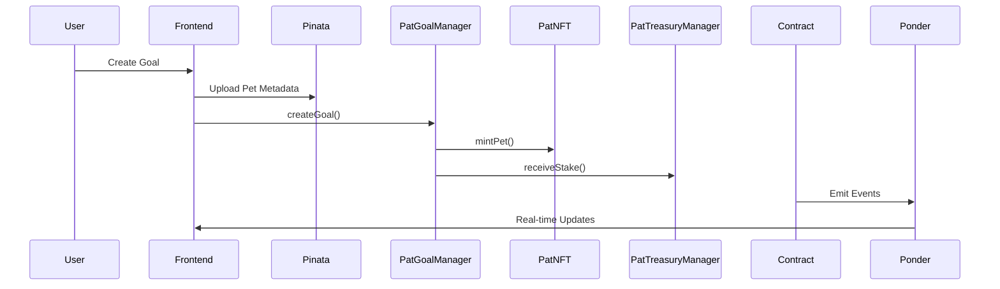
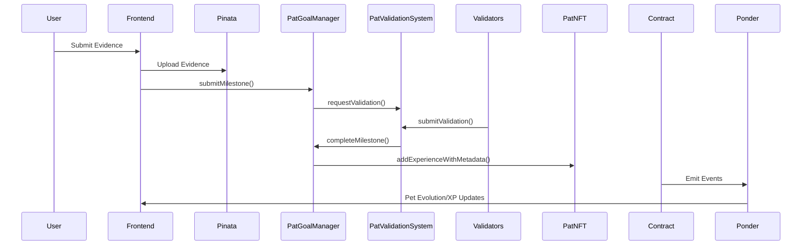
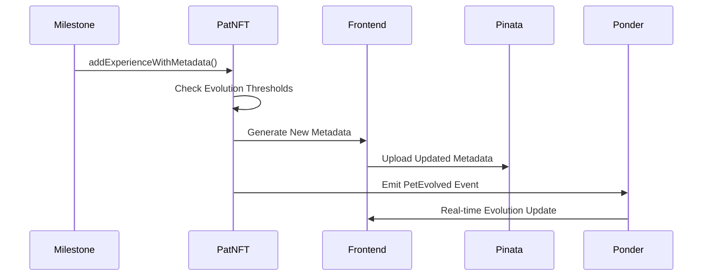

# Pet Pat Technical Documentation

## Frontend Engineer Integration Guide

### Table of Contents
1. [System Overview](#system-overview)
2. [Core User Flows](#core-user-flows)
3. [Smart Contract Integration](#smart-contract-integration)
4. [Pinata Metadata Management](#pinata-metadata-management)
5. [Ponder GraphQL Queries](#ponder-graphql-queries)
6. [Event Listeners](#event-listeners)
7. [Error Handling](#error-handling)
8. [Testing Guide](#testing-guide)

---

## System Overview

Pet Pat is a goal achievement platform where users stake PAT tokens, set goals with milestones, and grow virtual pets through validated progress.

### Architecture
```
Frontend ↔ Smart Contracts ↔ Ponder Indexer ↔ GraphQL API
                ↕
           Pinata IPFS (Metadata)
```

### Core Components
- **5 Smart Contracts**: PATToken, PatTreasuryManager, PatValidationSystem, PatNFT, PatGoalManager
- **Ponder Indexer**: Real-time event indexing and GraphQL API
- **Pinata IPFS**: Decentralized metadata storage for pet images/data

---

## Core User Flows

### 1. Goal Creation Flow


### 2. Milestone Submission Flow


### 3. Pet Evolution Flow


---

## Smart Contract Integration

### Required Contract Instances
```javascript
// Contract addresses (from deployment)
const CONTRACTS = {
  PAT_TOKEN: "0x...",
  PAT_TREASURY_MANAGER: "0x...", 
  PAT_VALIDATION_SYSTEM: "0x...",
  PAT_NFT: "0x...",
  PAT_GOAL_MANAGER: "0x..."
};

// ABI imports
import { 
  PATTokenABI, 
  PatGoalManagerABI, 
  PatNFTABI,
  PatTreasuryManagerABI,
  PatValidationSystemABI 
} from './abis';
```

### Primary Write Functions by User Action

#### 1. Create Goal
```javascript
// Contract: PatGoalManager
await patGoalManager.createGoal(
  title,                    // string
  stakeAmount,             // uint256 (in wei)
  durationDays,            // uint256
  petName,                 // string
  petType,                 // 0=DRAGON, 1=CAT, 2=PLANT
  petMetadataIPFS,         // string (from Pinata)
  totalMilestones          // uint256
);
```

#### 2. Create Milestone
```javascript
// Contract: PatGoalManager
await patGoalManager.createMilestone(
  goalId,                  // uint256
  description              // string
);
```

#### 3. Submit Milestone Evidence
```javascript
// Contract: PatGoalManager
await patGoalManager.submitMilestone(
  milestoneId,            // uint256
  evidenceIPFS            // string (from Pinata)
);
```

#### 4. Approve PAT Token Spending
```javascript
// Contract: PATToken (before creating goals)
await patToken.approve(
  CONTRACTS.PAT_TREASURY_MANAGER,  // spender
  stakeAmount                      // amount
);
```

#### 5. Register as Validator
```javascript
// Contract: PatValidationSystem
await patValidationSystem.registerValidator(
  stakeAmount              // uint256 (minimum 50 PAT)
);
```

#### 6. Submit Validation
```javascript
// Contract: PatValidationSystem
await patValidationSystem.submitValidation(
  milestoneId,            // uint256
  approve,                // bool
  comment                 // string
);
```

### Read-Only Functions (Use Sparingly)
```javascript
// Check if goal exists and is active
const isActive = await patGoalManager.isGoalActive(goalId);

// Check if goal is expired
const isExpired = await patGoalManager.isGoalExpired(goalId);

// Get pet existence
const exists = await patNFT.exists(tokenId);

// Get total supply
const totalSupply = await patNFT.totalSupply();

// Get stake tier info
const tierInfo = await patTreasuryManager.getStakeTierInfo(tierIndex);

// Calculate potential reward
const [totalReward, bonusReward, tier] = await patTreasuryManager.calculateReward(stakeAmount);
```

---

## Pinata Metadata Management

### Required Pinata Setup
```javascript
const PINATA_CONFIG = {
  apiKey: process.env.REACT_APP_PINATA_API_KEY,
  secretKey: process.env.REACT_APP_PINATA_SECRET_KEY,
  gateway: "https://gateway.pinata.cloud/ipfs/"
};
```

### Pet Metadata Template
```javascript
const generatePetMetadata = (petData) => ({
  name: petData.name,
  description: "A Pat Pet companion that grows with your goal achievements",
  image: `ipfs://${getImageHash(petData.petType, petData.stage, petData.isHappy)}`,
  external_url: `https://patpet.xyz/pet/${petData.tokenId}`,
  attributes: [
    { trait_type: "Pet Type", value: getPetTypeName(petData.petType) },
    { trait_type: "Evolution Stage", value: getStageName(petData.stage) },
    { trait_type: "Level", value: petData.level },
    { trait_type: "Experience", value: petData.experience },
    { trait_type: "Mood", value: petData.isHappy ? "Happy" : "Sad" },
    { trait_type: "Milestones Completed", value: petData.totalMilestonesCompleted },
    { trait_type: "Goal ID", value: petData.goalId },
    { trait_type: "Birth Date", value: petData.birthTime },
    { trait_type: "Rarity", value: getRarityFromStage(petData.stage) }
  ],
  properties: {
    last_updated: Date.now(),
    version: petData.version || 1,
    pet_type_numeric: petData.petType,
    stage_numeric: petData.stage
  }
});

// Helper functions
const getPetTypeName = (petType) => {
  const types = ["Dragon", "Cat", "Plant"];
  return types[petType] || "Unknown";
};

const getStageName = (stage) => {
  const stages = ["Egg", "Baby", "Adult"];
  return stages[stage] || "Unknown";
};

const getRarityFromStage = (stage) => {
  const rarities = ["Common", "Rare", "Legendary"];
  return rarities[stage] || "Common";
};
```

### Image Hash Mapping
```javascript
const IMAGE_HASHES = {
  DRAGON: {
    EGG: { happy: "QmDragonEggHappyPNG", sad: "QmDragonEggSadPNG" },
    BABY: { happy: "QmDragonBabyHappyPNG", sad: "QmDragonBabySadPNG" },
    ADULT: { happy: "QmDragonAdultHappyPNG", sad: "QmDragonAdultSadPNG" }
  },
  CAT: {
    EGG: { happy: "QmCatEggHappyPNG", sad: "QmCatEggSadPNG" },
    BABY: { happy: "QmCatBabyHappyPNG", sad: "QmCatBabySadPNG" },
    ADULT: { happy: "QmCatAdultHappyPNG", sad: "QmCatAdultSadPNG" }
  },
  PLANT: {
    EGG: { happy: "QmPlantSeedHappyPNG", sad: "QmPlantSeedSadPNG" },
    BABY: { happy: "QmPlantSproutHappyPNG", sad: "QmPlantSproutSadPNG" },
    ADULT: { happy: "QmPlantAdultHappyPNG", sad: "QmPlantAdultSadPNG" }
  }
};

const getImageHash = (petType, stage, isHappy) => {
  const typeNames = ["DRAGON", "CAT", "PLANT"];
  const stageNames = ["EGG", "BABY", "ADULT"];
  const mood = isHappy ? "happy" : "sad";
  
  return IMAGE_HASHES[typeNames[petType]]?.[stageNames[stage]]?.[mood] || "QmDefaultPetPNG";
};
```

### Upload Functions
```javascript
// Upload pet metadata to Pinata
const uploadMetadata = async (metadata, tokenId) => {
  const response = await fetch('https://api.pinata.cloud/pinning/pinJSONToIPFS', {
    method: 'POST',
    headers: {
      'Content-Type': 'application/json',
      'pinata_api_key': PINATA_CONFIG.apiKey,
      'pinata_secret_api_key': PINATA_CONFIG.secretKey
    },
    body: JSON.stringify({
      pinataContent: metadata,
      pinataMetadata: {
        name: `pet-${tokenId}-metadata-${Date.now()}`,
        keyvalues: {
          type: 'pet_metadata',
          tokenId: tokenId?.toString() || 'new',
          timestamp: Date.now().toString(),
          petType: metadata.attributes.find(attr => attr.trait_type === "Pet Type")?.value || 'Unknown'
        }
      }
    })
  });
  
  const result = await response.json();
  return result.IpfsHash;
};

// Upload evidence file
const uploadEvidence = async (file) => {
  const formData = new FormData();
  formData.append('file', file);
  
  const metadata = JSON.stringify({
    name: `evidence-${Date.now()}`,
    keyvalues: {
      type: 'milestone_evidence',
      timestamp: Date.now().toString(),
      fileType: file.type
    }
  });
  formData.append('pinataMetadata', metadata);
  
  const response = await fetch('https://api.pinata.cloud/pinning/pinFileToIPFS', {
    method: 'POST',
    headers: {
      'pinata_api_key': PINATA_CONFIG.apiKey,
      'pinata_secret_api_key': PINATA_CONFIG.secretKey
    },
    body: formData
  });
  
  const result = await response.json();
  return result.IpfsHash;
};
```

---

## Ponder GraphQL Queries

### User Dashboard Queries

#### Get User Goals
```graphql
query GetUserGoals($userAddress: String!) {
  goalCreateds(where: { owner: $userAddress }) {
    id
    goalId
    title
    stakeAmount
    endTime
    totalMilestones
    petTokenId
    petType
    petName
    timestamp
    milestonesCompleted
  }
}
```

#### Get Goal Details with Milestones
```graphql
query GetGoalDetails($goalId: String!) {
  goalCreateds(where: { goalId: $goalId }) {
    id
    goalId
    owner
    title
    stakeAmount
    endTime
    totalMilestones
    petTokenId
    petType
    petName
    timestamp
  }
  
  milestoneCreateds(where: { goalId: $goalId }) {
    id
    milestoneId
    description
    milestoneIndex
    timestamp
  }
  
  milestoneCompleteds(where: { goalId: $goalId }) {
    id
    milestoneId
    xpAwarded
    progressPercentage
    timestamp
  }
  
  milestoneSubmitteds(where: { goalId: $goalId }) {
    id
    milestoneId
    submitter
    evidenceIPFS
    timestamp
  }
}
```

#### Get Pet Details and Evolution History
```graphql
query GetPetDetails($tokenId: String!) {
  petMinteds(where: { tokenId: $tokenId }) {
    id
    tokenId
    owner
    name
    petType
    goalId
    metadataIPFS
    timestamp
  }
  
  experienceGaineds(where: { tokenId: $tokenId }) {
    id
    experienceAmount
    newTotalExperience
    newLevel
    reason
    newMetadataIPFS
    timestamp
  }
  
  petEvolveds(where: { tokenId: $tokenId }) {
    id
    fromStage
    toStage
    currentExperience
    evolutionTime
    newMetadataIPFS
    timestamp
  }
  
  petMoodChangeds(where: { tokenId: $tokenId }) {
    id
    oldMood
    newMood
    reason
    newMetadataIPFS
    timestamp
  }
  
  milestoneCompleteds(where: { tokenId: $tokenId }) {
    id
    newMilestoneCount
    timestamp
  }
}
```

### Validation System Queries

#### Get Validation Requests for Validator
```graphql
query GetValidatorRequests($validatorAddress: String!) {
  validationRequesteds(where: { assignedValidators_contains: [$validatorAddress] }) {
    id
    milestoneId
    submitter
    evidenceIPFS
    goalStakeAmount
    requiredValidators
    assignedValidators
    deadline
    timestamp
  }
  
  validationSubmitteds(where: { validator: $validatorAddress }) {
    id
    milestoneId
    approved
    comment
    currentApprovals
    currentRejections
    timestamp
  }
}
```

#### Get Validator Profile
```graphql
query GetValidatorProfile($validatorAddress: String!) {
  validatorRegistereds(where: { validator: $validatorAddress }) {
    id
    validator
    stakedAmount
    initialReputationScore
    timestamp
  }
  
  reputationUpdateds(where: { validator: $validatorAddress }) {
    id
    oldReputationScore
    newReputationScore
    wasAccurate
    totalValidations
    accurateValidations
    accuracyRate
    timestamp
  }
  
  validatorRewardeds(where: { validator: $validatorAddress }) {
    id
    milestoneId
    amount
    wasAccurate
    bonusPercentage
    newReputationScore
    timestamp
  }
}
```

### Analytics Queries

#### Platform Statistics
```graphql
query GetPlatformStats {
  goalSystemStatistics(orderBy: timestamp, orderDirection: desc, first: 1) {
    totalGoalsCreated
    activeGoals
    completedGoals
    failedGoals
    successRate
    totalStakeAmount
    totalMilestonesCreated
    totalMilestonesCompleted
    averageGoalDuration
    timestamp
  }
  
  petStatisticsSnapshots(orderBy: timestamp, orderDirection: desc, first: 1) {
    totalSupply
    totalEggStage
    totalBabyStage
    totalAdultStage
    totalHappyPets
    totalSadPets
    averageExperience
    timestamp
  }
  
  validationStatistics(orderBy: timestamp, orderDirection: desc, first: 1) {
    totalRequests
    totalCompleted
    totalActiveValidators
    totalRewardsDistributed
    systemAccuracyRate
    timestamp
  }
}
```

#### Treasury Analytics
```graphql
query GetTreasuryStats {
  ecosystemSnapshots(orderBy: timestamp, orderDirection: desc, first: 1) {
    totalSupply
    maxSupply
    totalRewardsDistributed
    totalStakesLost
    remainingMintable
    timestamp
  }
  
  rewardDistributeds {
    id
    recipient
    amount
    reason
    distributor
    newTotalRewards
    timestamp
  }
  
  stakeLostRecordeds {
    id
    user
    amount
    reason
    recorder
    newTotalStakesLost
    timestamp
  }
}
```

### Real-time Event Subscriptions
```graphql
subscription GoalEvents($userAddress: String!) {
  goalCreateds(where: { owner: $userAddress }) {
    goalId
    title
    petTokenId
    timestamp
  }
  
  milestoneCompleteds(where: { goalOwner: $userAddress }) {
    goalId
    milestoneId
    xpAwarded
    progressPercentage
    timestamp
  }
  
  petEvolveds(where: { owner: $userAddress }) {
    tokenId
    fromStage
    toStage
    timestamp
  }
  
  goalCompleteds(where: { owner: $userAddress }) {
    goalId
    totalMilestonesCompleted
    bonusXPAwarded
    stakeReward
    wasEarlyCompletion
    timestamp
  }
  
  goalFaileds(where: { owner: $userAddress }) {
    goalId
    milestonesCompleted
    totalMilestones
    stakeLost
    failureReason
    timestamp
  }
}
```

---

## Event Listeners

### Required Event Listeners for Real-time Updates

#### Goal Events
```javascript
// Listen for goal completion
patGoalManager.on('GoalCompleted', (
  goalId, 
  owner, 
  totalMilestonesCompleted, 
  bonusXPAwarded, 
  stakeReward, 
  completionTime, 
  wasEarlyCompletion, 
  finalPetMetadataIPFS, 
  timestamp
) => {
  // Update UI with completion celebration
  showCompletionAnimation();
  displayRewardsSummary({
    bonusXP: bonusXPAwarded,
    stakeReward: stakeReward,
    earlyBonus: wasEarlyCompletion
  });
  // Update pet to final evolved state
  updatePetDisplay(finalPetMetadataIPFS);
});

// Listen for goal failure
patGoalManager.on('GoalFailed', (
  goalId, 
  owner, 
  milestonesCompleted, 
  totalMilestones, 
  stakeLost, 
  failureReason, 
  sadPetMetadataIPFS, 
  timestamp
) => {
  // Update UI with failure state
  showFailureAnimation();
  displayStakeLoss(stakeLost);
  // Show pet sad animation
  updatePetDisplay(sadPetMetadataIPFS);
  showFailureReason(failureReason);
});
```

#### Milestone Events
```javascript
// Listen for milestone completion
patGoalManager.on('MilestoneCompleted', (
  milestoneId, 
  goalId, 
  goalOwner, 
  xpAwarded, 
  newMilestonesCompleted, 
  totalMilestones, 
  progressPercentage, 
  petMetadataIPFS, 
  timestamp
) => {
  // Update progress bar
  updateProgressBar(progressPercentage);
  // Show XP gained animation
  showXPGainedAnimation(xpAwarded);
  // Update pet display
  updatePetDisplay(petMetadataIPFS);
  // Check for potential evolution
  checkEvolutionThreshold(newMilestonesCompleted * 25);
});

// Listen for milestone rejection
patGoalManager.on('MilestoneRejected', (
  milestoneId, 
  goalId, 
  goalOwner, 
  reason, 
  sadPetMetadataIPFS, 
  timestamp
) => {
  // Show rejection notification
  showRejectionNotification(reason);
  // Display feedback to user
  displayValidationFeedback(milestoneId);
  // Update pet to sad state
  updatePetDisplay(sadPetMetadataIPFS);
});
```

#### Pet Events
```javascript
// Listen for pet evolution
patNFT.on('PetEvolved', (
  tokenId, 
  goalId, 
  owner, 
  fromStage, 
  toStage, 
  currentExperience, 
  evolutionTime, 
  newMetadataIPFS, 
  timestamp
) => {
  // Show evolution animation
  showEvolutionAnimation(fromStage, toStage);
  // Update pet display
  updatePetDisplay(newMetadataIPFS);
  // Celebrate milestone achievement
  showEvolutionCelebration();
  // Update achievement badges
  updateAchievements(toStage);
});

// Listen for mood changes
patNFT.on('PetMoodChanged', (
  tokenId, 
  goalId, 
  owner, 
  oldMood, 
  newMood, 
  reason, 
  newMetadataIPFS, 
  timestamp
) => {
  // Update pet expression
  updatePetExpression(newMood);
  // Show appropriate animations
  if (newMood) {
    showHappyAnimation();
  } else {
    showSadAnimation();
  }
  // Display mood change reason
  showMoodChangeReason(reason);
  // Update metadata
  updatePetDisplay(newMetadataIPFS);
});

// Listen for experience gained
patNFT.on('ExperienceGained', (
  tokenId, 
  goalId, 
  owner, 
  experienceAmount, 
  newTotalExperience, 
  oldLevel, 
  newLevel, 
  reason, 
  newMetadataIPFS, 
  timestamp
) => {
  // Show XP animation
  animateXPGain(experienceAmount);
  // Update XP bar
  updateExperienceBar(newTotalExperience);
  // Check for level up
  if (newLevel > oldLevel) {
    showLevelUpAnimation(newLevel);
  }
  // Update pet display
  updatePetDisplay(newMetadataIPFS);
});
```

#### Validation Events
```javascript
// Listen for validation resolution
patValidationSystem.on('ValidationResolved', (
  milestoneId, 
  status, 
  totalApprovals, 
  totalRejections, 
  totalValidators, 
  validators, 
  votes, 
  resolutionTime, 
  timestamp
) => {
  // Update milestone status
  updateMilestoneStatus(milestoneId, status);
  // Show validation results
  displayValidationResults({
    approvals: totalApprovals,
    rejections: totalRejections,
    validators: validators,
    votes: votes
  });
  // Trigger appropriate pet updates
  if (status === 'APPROVED') {
    triggerMilestoneCompletion(milestoneId);
  } else {
    triggerMilestoneRejection(milestoneId);
  }
});

// Listen for validator rewards
patValidationSystem.on('ValidatorRewarded', (
  validator, 
  milestoneId, 
  amount, 
  wasAccurate, 
  bonusPercentage, 
  newReputationScore, 
  timestamp
) => {
  // Show validator reward notification
  if (validator === currentUserAddress) {
    showValidatorReward({
      amount: amount,
      accuracy: wasAccurate,
      bonus: bonusPercentage,
      reputation: newReputationScore
    });
  }
});
```

---

## Error Handling

### Common Error Scenarios

#### Transaction Errors
```javascript
const handleTransactionError = async (error, operation) => {
  console.error(`Transaction failed for ${operation}:`, error);
  
  if (error.code === 'INSUFFICIENT_FUNDS') {
    showError('Insufficient ETH for gas fees');
  } else if (error.message.includes('Transfer failed')) {
    showError('Insufficient PAT tokens or approval needed');
  } else if (error.code === 'USER_REJECTED') {
    showError('Transaction cancelled by user');
  } else if (error.message.includes('Not authorized')) {
    showError('Contract authorization error - please contact support');
  } else if (error.message.includes('Goal not active')) {
    showError('This goal is no longer active');
  } else if (error.message.includes('Already completed')) {
    showError('This milestone has already been completed');
  } else if (error.message.includes('Validation deadline passed')) {
    showError('Validation period has expired');
  } else {
    showError(`Transaction failed: ${error.message}`);
  }
};

// Usage
try {
  const tx = await patGoalManager.createGoal(...params);
  await tx.wait();
} catch (error) {
  handleTransactionError(error, 'goal creation');
}
```

#### Contract State Validation
```javascript
// Check contract state before transactions
const validateGoalState = async (goalId) => {
  try {
    const isActive = await patGoalManager.isGoalActive(goalId);
    const isExpired = await patGoalManager.isGoalExpired(goalId);
    
    if (!isActive) {
      throw new Error('Goal is not active');
    }
    if (isExpired) {
      throw new Error('Goal has expired');
    }
    
    return true;
  } catch (error) {
    console.error('Goal state validation failed:', error);
    return false;
  }
};

// Check validator eligibility
const validateValidatorState = async (validatorAddress) => {
  try {
    // Query Ponder for validator status
    const { data } = await apolloClient.query({
      query: GET_VALIDATOR_PROFILE,
      variables: { validatorAddress }
    });
    
    if (!data.validatorRegistereds.length) {
      throw new Error('Not registered as validator');
    }
    
    // Additional checks can be added here
    return true;
  } catch (error) {
    console.error('Validator state validation failed:', error);
    return false;
  }
};
```

#### Pinata Upload Errors
```javascript
const handlePinataError = (error) => {
  console.error('Pinata upload error:', error);
  
  if (error.status === 401) {
    return 'Invalid Pinata API credentials';
  } else if (error.status === 413) {
    return 'File too large for upload (max 100MB)';
  } else if (error.status === 429) {
    return 'Rate limit exceeded, please try again later';
  } else if (error.name === 'NetworkError') {
    return 'Network error - please check your connection';
  } else {
    return 'Upload failed, please try again';
  }
};

const uploadWithRetry = async (uploadFunction, maxRetries = 3) => {
  for (let attempt = 1; attempt <= maxRetries; attempt++) {
    try {
      return await uploadFunction();
    } catch (error) {
      if (attempt === maxRetries) {
        throw new Error(handlePinataError(error));
      }
      // Wait before retry (exponential backoff)
      await new Promise(resolve => setTimeout(resolve, 1000 * attempt));
    }
  }
};
```

#### GraphQL Query Errors
```javascript
const handleGraphQLError = (error) => {
  console.error('GraphQL query error:', error);
  
  if (error.networkError) {
    return 'Network error - please check your connection';
  } else if (error.graphQLErrors?.length > 0) {
    return `Query error: ${error.graphQLErrors[0].message}`;
  } else {
    return 'Failed to fetch data, please try again';
  }
};

// Query with error handling
const queryWithErrorHandling = async (query, variables) => {
  try {
    const { data, error } = await apolloClient.query({
      query,
      variables,
      errorPolicy: 'all'
    });
    
    if (error) {
      throw error;
    }
    
    return data;
  } catch (error) {
    const errorMessage = handleGraphQLError(error);
    showError(errorMessage);
    throw error;
  }
};
```

---

## Implementation Best Practices

### Smart Contract Integration Guidelines

#### Pre-Transaction Validation
```javascript
// Always validate contract state before transactions
const validateBeforeGoalCreation = async (userAddress, stakeAmount) => {
  // Check PAT balance
  const balance = await patToken.balanceOf(userAddress);
  if (balance.lt(ethers.utils.parseEther(stakeAmount))) {
    throw new Error('Insufficient PAT balance');
  }
  
  // Check allowance
  const allowance = await patToken.allowance(userAddress, CONTRACTS.PAT_TREASURY_MANAGER);
  if (allowance.lt(ethers.utils.parseEther(stakeAmount))) {
    throw new Error('Insufficient token approval');
  }
  
  return true;
};

// Validate goal state before milestone submission
const validateMilestoneSubmission = async (goalId, milestoneId) => {
  const isActive = await patGoalManager.isGoalActive(goalId);
  const isExpired = await patGoalManager.isGoalExpired(goalId);
  
  if (!isActive) throw new Error('Goal is not active');
  if (isExpired) throw new Error('Goal has expired');
  
  return true;
};
```

#### Transaction Pattern
```javascript
// Standard transaction flow with proper error handling
const executeTransaction = async (contractMethod, params, description) => {
  try {
    // Estimate gas first
    const gasEstimate = await contractMethod.estimateGas(...params);
    const gasLimit = gasEstimate.mul(110).div(100); // Add 10% buffer
    
    // Execute transaction
    const tx = await contractMethod(...params, { gasLimit });
    
    // Show pending state
    showTransactionPending(tx.hash, description);
    
    // Wait for confirmation
    const receipt = await tx.wait();
    
    // Show success
    showTransactionSuccess(receipt.transactionHash, description);
    
    return receipt;
  } catch (error) {
    handleTransactionError(error, description);
    throw error;
  }
};
```

### Data Fetching Strategies

#### Optimized GraphQL Queries
```javascript
// Use fragments for reusable query parts
const PET_DETAILS_FRAGMENT = gql`
  fragment PetDetails on PetMinted {
    tokenId
    owner
    name
    petType
    goalId
    metadataIPFS
    timestamp
  }
`;

// Combine related data in single queries
const GET_COMPLETE_GOAL_DATA = gql`
  query GetCompleteGoalData($goalId: String!, $userAddress: String!) {
    goalCreateds(where: { goalId: $goalId }) {
      ...GoalDetails
    }
    
    petMinteds(where: { goalId: $goalId }) {
      ...PetDetails
    }
    
    milestoneCreateds(where: { goalId: $goalId }) {
      milestoneId
      description
      milestoneIndex
    }
    
    userGoals: goalCreateds(where: { owner: $userAddress }) {
      goalId
      title
      status
    }
  }
`;
```

#### Cache Management
```javascript
// Setup Apollo Client with proper caching
const apolloClient = new ApolloClient({
  uri: process.env.REACT_APP_PONDER_API_URL,
  cache: new InMemoryCache({
    typePolicies: {
      GoalCreated: {
        keyFields: ['goalId']
      },
      PetMinted: {
        keyFields: ['tokenId']
      }
    }
  }),
  defaultOptions: {
    watchQuery: {
      errorPolicy: 'all',
      fetchPolicy: 'cache-and-network'
    }
  }
});
```

### Performance Optimization

#### Batch Operations
```javascript
// Batch multiple operations when possible
const createGoalWithMilestones = async (goalData, milestones) => {
  // 1. Create goal first
  const goalTx = await patGoalManager.createGoal(...goalParams);
  const goalReceipt = await goalTx.wait();
  const goalId = goalReceipt.events.find(e => e.event === 'GoalCreated').args.goalId;
  
  // 2. Batch milestone creation
  const milestonePromises = milestones.map(milestone => 
    patGoalManager.createMilestone(goalId, milestone.description)
  );
  
  await Promise.all(milestonePromises);
  
  return goalId;
};
```

#### Event Subscription Management
```javascript
// Efficiently manage event subscriptions
class EventManager {
  constructor() {
    this.subscriptions = new Map();
  }
  
  subscribe(contractName, eventName, callback, filter = {}) {
    const key = `${contractName}-${eventName}`;
    
    if (this.subscriptions.has(key)) {
      this.unsubscribe(key);
    }
    
    const contract = this.getContract(contractName);
    const subscription = contract.on(eventName, callback);
    
    this.subscriptions.set(key, subscription);
  }
  
  unsubscribe(key) {
    const subscription = this.subscriptions.get(key);
    if (subscription) {
      subscription.removeAllListeners();
      this.subscriptions.delete(key);
    }
  }
  
  cleanup() {
    this.subscriptions.forEach((_, key) => this.unsubscribe(key));
  }
}

---

## Quick Reference

### Contract Write Functions by Feature

| Feature | Contract | Function | Parameters |
|---------|----------|----------|------------|
| Create Goal | PatGoalManager | `createGoal()` | title, stakeAmount, durationDays, petName, petType, petMetadataIPFS, totalMilestones |
| Create Milestone | PatGoalManager | `createMilestone()` | goalId, description |
| Submit Evidence | PatGoalManager | `submitMilestone()` | milestoneId, evidenceIPFS |
| Approve Tokens | PATToken | `approve()` | spender, amount |
| Register Validator | PatValidationSystem | `registerValidator()` | stakeAmount |
| Submit Validation | PatValidationSystem | `submitValidation()` | milestoneId, approve, comment |
| Force Complete Milestone | PatGoalManager | `completeMilestone()` | milestoneId, newPetMetadataIPFS |
| Add Bonus XP | PatGoalManager | `addBonusXP()` | goalId, xpAmount, reason, newPetMetadataIPFS |

### Pet Evolution Thresholds
- **EGG → BABY**: 100 XP (4 milestones)
- **BABY → ADULT**: 500 XP (20 milestones)  
- **Milestone XP**: 25 XP per milestone
- **Completion Bonus**: 100 XP per goal

### Pet Types (Enum Values)
- **0**: DRAGON 🐉
- **1**: CAT 🐱
- **2**: PLANT 🌱

### Evolution Stages (Enum Values)
- **0**: EGG 🥚
- **1**: BABY 👶
- **2**: ADULT 🦸

### Goal Status (Enum Values)
- **0**: ACTIVE ⚡
- **1**: COMPLETED ✅
- **2**: FAILED ❌

### Validation Status (Enum Values)
- **0**: PENDING ⏳
- **1**: APPROVED ✅
- **2**: REJECTED ❌
- **3**: DISPUTED ⚠️

### Stake Tiers
| Tier | Range (PAT) | Multiplier | Name |
|------|-------------|------------|------|
| 0 | 10-99 | 110% | Sprout |
| 1 | 100-499 | 125% | Bloom |
| 2 | 500-1,999 | 150% | Flourish |
| 3 | 2,000-9,999 | 200% | Thrive |
| 4 | 10,000+ | 300% | Legend |

---

## Support

For technical questions or issues:
1. Check contract events in Ponder for debugging information
2. Verify Pinata uploads are successful before contract interactions
3. Ensure proper token approvals before transactions
4. Test on local blockchain before mainnet deployment
5. Monitor gas fees and set appropriate limits

### Common Debugging Steps
1. **Transaction Fails**: Check user's PAT balance and approvals
2. **Pet Not Evolving**: Verify XP thresholds and metadata updates
3. **Validation Stuck**: Check if enough validators are registered and active
4. **Metadata Issues**: Validate IPFS hashes and Pinata connectivity
5. **GraphQL Errors**: Confirm Ponder indexer is running and synced

**Remember**: Always use Ponder GraphQL queries for reading data instead of contract calls for better performance and user experience!